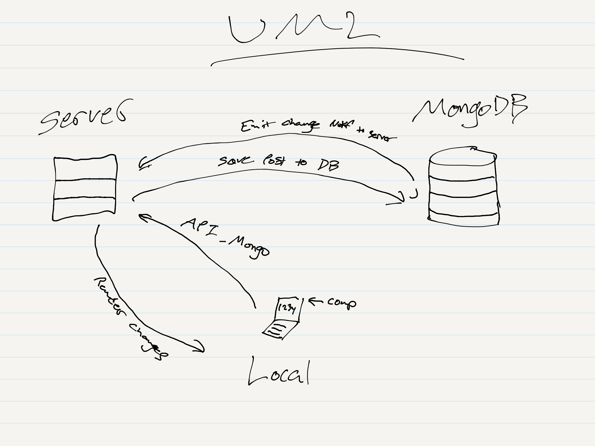

# LAB - 32

## Project Name

### Author: Student/Group Name

### Links and Resources
* [submission PR](https://github.com/adrianagraybill/lab-Custom-Hooks-Sockets-and-Fetch/pull/2)
* [front-end](https://pedantic-spence-49da3f.netlify.com/)

### Modules
* app.js
* todo.js
* todo-list.js
* index.js

### Setup
#### `.env` requirements
* REACT_APP_Q_SERVER
* REACT_APP_API

#### Running the app
* `npm start`

Endpoint: /api/v1/todo/
* Returns an object

Required data:
* text - text
* category - text
* assignee - text
* difficulty - number
* complete - boolean

#### UML

